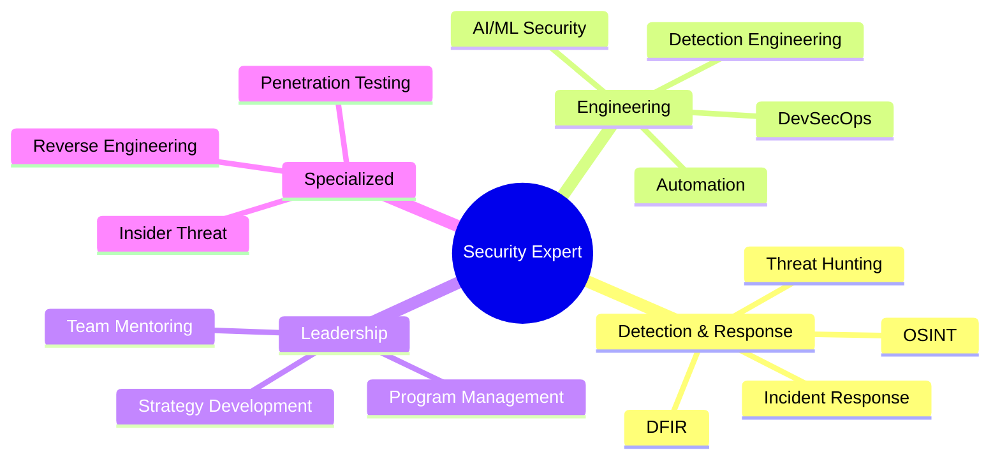

# 👨‍💻 William "Alec" Akin

<div align="center">

> 🛡️ Security Engineer II at Amazon | Cybersecurity Expert | AI/ML Security Innovator | Neurodivergent Advocate

[](https://alecakin.com/about)
[](https://www.linkedin.com/in/wakin)
[](https://github.com/rainmana)
[](mailto:w.alec.akin@gmail.com)

</div>

## 🧠 About Me

```python
class SecurityEngineer:
    def __init__(self):
        self.name = "Alec Akin"
        self.role = "Security Engineer II @ Amazon"
        self.experience = {
            "total": "15+ years IT",
            "security": "12+ years cybersecurity"
        }
        self.specialties = [
            "Incident Response",
            "Detection Engineering",
            "AI/ML Security",
            "Insider Threat",
            "DevSecOps"
        ]
        self.languages = ["Python", "BASH", "GoLang"]
```

With 15+ years of IT experience and a lifelong passion for cybersecurity, I specialize in building and securing enterprise-scale systems. My neurodivergent perspective brings unique insights to complex security challenges, driving innovation in incident response, detection engineering, and AI/ML security solutions.

## 🛠️ Technical Stack

<div align="center">

### 💻 Languages & Tools


### 🔒 Security Tools & Platforms


</div>

## 🚀 Professional Experience

### 🌟 Amazon (2023 - Present)
**Security Engineer II | CSSec Threat Ops**
- Reduced MTTR from 93 days to 2.5 days through automation
- Eliminated backlog of 1,300+ cases via process improvement
- Led AI/ML security research and implementation
- Designed low-code security automation platforms

### ⚡ T-Mobile (2020 - 2023)
**Senior Engineer, Cybersecurity**
- Led DevSecOps and security response automation
- Pioneered OpenAI applications in cybersecurity
- Spearheaded Zero Trust architecture transition
- Managed cloud security across Azure, AWS, GCP

### 🏥 Delta Dental of Idaho (2019 - 2020)
**Cybersecurity Program Manager**
- Achieved 70% reduction in security incidents
- Led enterprise SIEM migration (LogRhythm to Splunk)
- Implemented comprehensive vulnerability management
- Directed major incident response operations

### 💾 Previous Roles
- **Micron**: Incident Response Analyst (2018-2019)
- **NCC Group**: Security Consultant (2017)
- **Schweitzer Engineering**: Security Analyst (2014-2017)
- **Boeing**: Information Security Intern (2011-2014)

## 📊 Expertise Areas



## 🎓 Education

- 📚 **Bachelor of Science**: Cybersecurity - Purdue University Global (4.0 GPA) (Incomplete/To be finished later)

## 🏆 Recent Achievements

- 🌟 Amazon "Trailblazer Award" - Generative AI Hackathon (2024)
- 🎯 Reduced incident response time by 97% through automation
- 📝 Published cybersecurity articles and policies
- 🗣️ Speaker at Develop.Idaho Conference

## 🌐 Additional Involvement

- 🚔 Board Treasurer - Police Data Accessibility Project
- 🪖 Cyber Auxiliarist - US Marine Corps Cyber Auxiliary
- 🛡️ Former E4 Specialist - Texas State Guard

## 📈 GitHub Stats

<div align="center">


</div>

---

<div align="center">


[](https://github.com/rainmana)

*"Security is a journey, not a destination."*

</div>
